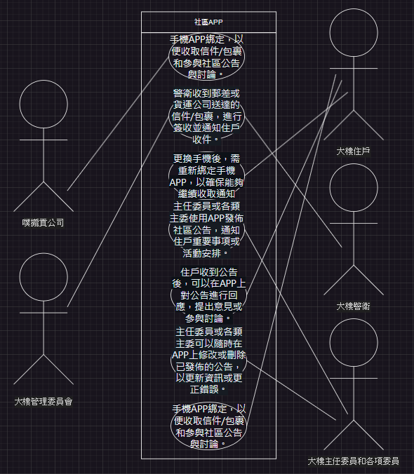

# 第3次作業-作業-HW3
>
>學號：1234567
> 
>姓名：王小明
> 
>作業撰寫時間：180 (mins，包含程式撰寫時間)
> 
>最後撰寫文件日期：2023/09/22
>

本份文件包含以下主題：(至少需下面兩項，若是有多者可以自行新增)
- [x] 說明內容
- [x] 個人認為完成作業須具備觀念

## 說明程式與內容
# a.
|利害關係人|目標|
|---|---|
噗攏貢公司|1.提供高效的社區大樓管理解決方案。  2.擴大市場佔有率，增加客戶數量。 3.提升專有APP的功能和服務，以滿足客戶需求。
社區大樓管理委員會|1.提升社區大樓的管理效率和質量。 2.增進住戶滿意度，提供更好的居住環境。 3.保障社區大樓的安全和秩序。
社區大樓住戶|1.方便快捷地收取信件和包裹。 2.及時獲取社區公告和重要資訊。 3.參與社區討論和活動，提出建議和意見。
社區大樓警衛|1.完成信件和包裹收發任務，確保準確無誤。 2.確保社區大樓的安全和秩序，防止不良事件發生。 3.熟練掌握專有APP的操作，以便有效地執行任務。
社區大樓主任委員和各項委員|1.管理和組織社區大樓的公告和活動。 2.監督社區管理工作，提出改善建議和方案。 3.維護社區大樓的形象和聲譽，解決住戶問題和糾紛。
# b.
|事件|使用案例|
|---|---|
新住戶入住|新住戶進行手機APP綁定，以便收取信件/包裹和參與社區公告與討論。
信件/包裹送達|警衛收到郵差或貨運公司送達的信件/包裹，進行簽收並通知住戶收件。
住戶更換手機|住戶更換手機後，需重新綁定手機APP，以確保能夠繼續收取通知和參與社區活動。
公告發佈|主任委員或各類主委使用APP發佈社區公告，通知住戶重要事項或活動安排。
公告回應|住戶收到公告後，可以在APP上對公告進行回應，提出意見或參與討論。
公告修改與刪除|主任委員或各類主委可以隨時在APP上修改或刪除已發佈的公告，以更新資訊或更正錯誤。
警衛操作失誤|警衛在收發信件/包裹或通知住戶時出現操作失誤，需要透過APP進行錯誤修正或通知管理委員會。
# c.  

## 個人認為完成作業須具備觀念

需要了解表格的配置方式與利害關係人與目標之間的關係，還有會發生的事件以及案例，及各個利害關係人與事件中的關係。